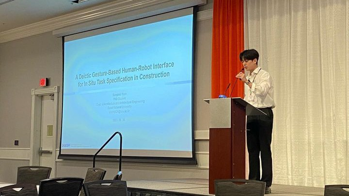

## Education

### Ph.D. in Architectural Engineering
Seoul National University, Seoul, South Korea  
February 2027 (Expected)

### M.S. in Architectural Engineering
Seoul National University, Seoul, South Korea  
February 2022  
- M.S. Thesis: "Challenges in Spatial Communication Using Deictic Gesture for Human-Robot Collaboration in Construction"

### B.S. in Architectural Engineering
Seoul National University, Seoul, South Korea  
February 2020  
- Graduated with Honors (Cum Laude)

## Academic & Professional Experience

### Research Assistant
Seoul National University  
2020-Present

Advisor: Professor Changbum R. Ahn

Contributed to interdisciplinary research projects spanning AEC, robotics, electronics, and field validation across academia, industry, and government collaborators.

- Multipurpose robotic platform and XR-based human-robot collaboration for work at height in construction
- Interactive communication systems for human-robot collaboration in construction
- Smart safety model factory development and evaluation standards for construction sites
- Modular construction planning and productivity support, including tower crane layout optimization and the MoMIS platform

### Intern
Daewoo E&C  
2018-2019

Coordinated site safety, construction supervision, and inspection during the demolition of a 36,595 m2 children's education, cultural, assembly, and sports facility in Seongnam, South Korea.

### Sergeant
Korean National Police Agency, Public Security Division  
2016-2018

Coordinated daily situational monitoring, command oversight, and personnel deployment planning for nationwide public assemblies and protests.

## Honors, Awards & Fellowships

- 2026: Best Paper Award, International Conference on Computing in Civil Engineering (i3CE 2026), 1st Place in the Research in Robotics, Sensing, and Human-Centered Computing
  Paper Title: “Multi-Skill Robot Learning from Long-Horizon Expert Demonstrations: A Case Study of Joint Putty Application.” Yoon, S., Park, M., and Ahn, C. R. (2026).
- 2024-2026: Ph.D. Fellowship, Basic Science Research Program, National Research Foundation of Korea (NRF)
- 2025: Graduate Fellowship, Korean Society of Automation and Robotics in Construction (KSARC)
- 2024: Editor's Choice Article, ASCE Journal of Computing in Civil Engineering
  Paper Title: “LaserDex: Improvising Spatial Tasks Using Deictic Gestures and Laser Pointing for Human-Robot Collaboration in Construction.” Yoon, S., Park, M., and Ahn, C. R. (2024).
- 2024: Best Paper Award, The 2024 Annual Conference of Korea Institute of Construction Engineering and Management (KICEM)
  Paper Title: “Imitation Learning Framework for Construction Tasks Using Constraint Learning.” Shin, S., Yoon, S., Park, M., Ahn, C. R. (2024).
- 2023: Graduate Fellowship, Foundation for Industrial Safety Partnerships
- 2023: Graduate Fellowship, Engineering Research Foundation
- 2022-2023: Academic Fellowship, Seoul National University
- 2022: Best Paper Award, The 2022 Autumn Annual Conference of Architectural Institute of Korea (AIK)
  Paper Title: “Workspace-Aware 3D Mapping Framework for Social Navigation in Construction Sites.” Park, J., Yoon, S., Park, M., Ahn, C. R. (2022).
- 2019-2022: Academic Fellowship, Seoul National University
- 2020: Graduate Fellowship, Hanssem DBEW Research Foundation
- 2019: Second Place Award, Graduation Exhibition, Seoul National University
- 2019: Second Place Award, Mooyoung CM Competition, Mooyoung CM

## Professional Leadership & Service Activities

### Professional

- 2025-Present: Member, Korea Robotics Society (KROS)
- 2024-Present: Student Member, Institute of Electrical and Electronics Engineers (IEEE)
- 2024-Present: Member, Korean Society of Automation and Robotics in Construction (KSARC)
- 2023-Present: Student Member, Data, Sensing and Analysis (DSA) Committee, ASCE
- 2022-Present: Student Member, American Society of Civil Engineers (ASCE)
- 2020-Present: Member, Korea Institute of Construction Engineering and Management
- 2020-Present: Member, Architectural Institute of Korea (AIK)

### Reviewer Activities

- 2026: Reviewer, Computing in Civil Engineering (i3CE 2026)
- 2025-Present: Reviewer, Automation in Construction
- 2025: Reviewer, Journal of Computing in Civil Engineering
