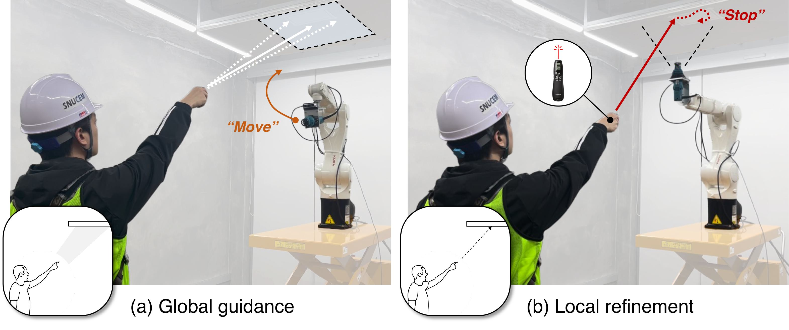

> **TL;DR** This project develops intuitive multimodal interfaces for spatial tasking in construction robotics. By combining deictic gestures, laser pointing, and speech commands, the system enables workers to communicate distant spatial goals to robots without relying on low-level robot control.

## Objectives

1. To enable construction workers to communicate spatial goals to robots without extensive training in robotics.
2. To support in-situ human–robot collaboration in construction environments where task locations and work areas may be modified on site.
3. To improve distant target specification by combining intuitive human spatial communication with robot-side perception and motion planning.

## Challenges

1. Construction robots have limited ability to understand spontaneous spatial instructions and goals communicated on the worksite.
2. Conventional interfaces, such as handheld controllers and teach pendants, require substantial training and can be inefficient for workers who are not robotics experts.
3. Gesture-based interfaces are intuitive but often lack the precision needed for distant spatial target estimation in large 3D construction workspaces.

## Approach

This project develops a multimodal human–robot interface for construction spatial tasking. The interface integrates deictic gestures, dynamic laser pointing, and speech commands to allow workers to specify where a robot should operate. In the LaserDex system, the interaction follows a global-to-local process: the worker first points to guide the robot toward a general region of interest, and then uses a laser pointer to specify the precise task area. The system estimates the indicated spatial goal by detecting, smoothing, and fitting the laser trajectory, while speech commands are used to trigger robot motion and task execution. The robot-side pipeline integrates environment mapping, gesture recognition, laser pointing estimation, speech recognition, and motion planning, and was evaluated in a drywall cutting scenario with distant target specification.

## Key takeaways

1. Multimodal interaction can combine the intuitiveness of human pointing with the precision required for construction robot operation.
2. Laser-based spatial indication provides a practical way to communicate distant spatial goals in large-scale construction workspaces.
3. In the evaluated drywall cutting scenario, LaserDex achieved an IoU of 0.830 when outlining a rectangular opening, compared with 0.514 for the handheld controller baseline.
4. The results indicate that construction workers may be able to task robots more effectively when interfaces are designed around familiar spatial communication behaviors rather than low-level robot control.

## Contribution

1. Proposed a multimodal human–robot interface for in-situ spatial tasking in construction environments.
2. Developed a global-to-local target identification method that combines deictic gesture-based coarse guidance with dynamic laser-based local refinement.
3. Demonstrated that laser-assisted spatial goal communication can improve the accuracy and usability of construction robot tasking compared with a handheld controller baseline.

## Related links

- Project page: [CEM Research Project](https://cem.snu.ac.kr/research/75)
- Paper: [ISARC 2021](https://doi.org/10.22260/ISARC2021/0067)
- Paper: [Journal of Construction Engineering and Management](https://doi.org/10.1061/JCEMD4.COENG-12997)
- Paper: [ASCE International Conference Proceedings](https://doi.org/10.1061/9780784485224.054)
- Paper: [ASCE International Conference Proceedings](https://doi.org/10.1061/9780784486115.027)
- Paper: [Journal of Construction Automation and Robotics](https://doi.org/10.55785/JCAR.3.3.6)
- Paper: [Journal of Computing in Civil Engineering](https://ascelibrary.org/doi/10.1061/JCCEE5.CPENG-5715)
