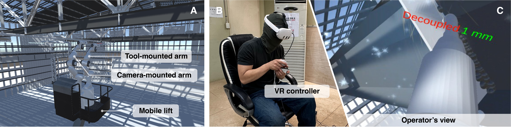
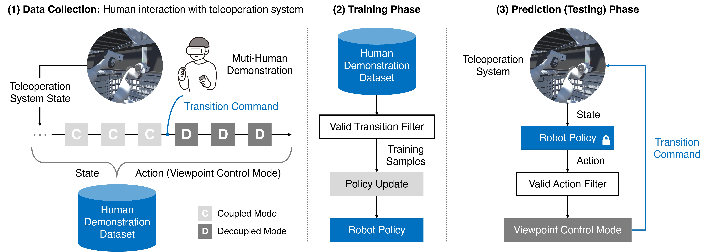

> **TL;DR**  
> This project studies how construction robot operators should view remote workspaces during teleoperation. It compares coupled, decoupled, and hybrid viewpoint control techniques and develops a learning-based model for user-aligned viewpoint transitions.

## Objectives

1. To investigate how dynamic viewpoint control affects task performance and user experience in teleoperated construction robots.
2. To compare coupled, decoupled, and hybrid viewpoint control techniques in VR-based robotic welding-at-height scenarios.
3. To learn user-aligned transitions between robot-coupled and robot-decoupled viewpoints from human-initiated teleoperation data.

## Challenges

1. Teleoperated construction tasks rely heavily on visual feedback, but fixed or task-agnostic cameras can limit situational awareness and task performance.
2. Coupled and decoupled viewpoint control techniques involve trade-offs between hand-eye coordination, workspace awareness, user workload, and control complexity.
3. Hybrid viewpoint control requires transitions that are predictable and minimally disruptive, but rule-based automatic switching may not align with operator intentions.

## Approach

This project develops and evaluates dynamic viewpoint control techniques for construction teleoperation in a VR-based robotic welding-at-height scenario. The system consists of a mobile lift and two robotic arms: a manipulation arm equipped with a welding tool and a camera-mounted arm that provides dynamic visual feedback to the operator. The first study compares five viewpoint control techniques, including coupled vision-motion, decoupled vision-motion with hand or head motion-based control, and hybrid vision-motion with manual or automatic switching. The evaluation examines task performance, welding quality, cognitive workload, usability, and user preference across novice and experienced welding users.

Building on this evaluation, the second study develops a viewpoint control mode prediction model for hybrid viewpoint control. Instead of relying on predefined transition rules, the model learns from human-initiated transitions collected during teleoperation. A transition-guided weighting scheme is used to emphasize peri-transition timesteps, allowing the model to better replicate when operators switch between robot-coupled and robot-decoupled viewpoints.

## Key takeaways

1. Dynamic viewpoint control is a key design factor for teleoperation in construction tasks that require both workspace exploration and precise manipulation.
2. Decoupled vision-motion with head motion-based control showed strong performance in task efficiency and user preference.
3. Hybrid vision-motion with manual switching was useful in occlusion-prone situations, reducing physical demand and improving welding quality.
4. Poorly timed automatic transitions can disrupt the operator’s workflow, indicating that viewpoint autonomy should be aligned with human viewing strategies.
5. The learning-based transition model improved transition timing prediction by 11% over standard behavioral cloning and 19% over weighted behavioral cloning baselines.

## Contribution

1. Provided an empirical evaluation of dynamic viewpoint control techniques for teleoperated robotic welding in construction.
2. Demonstrated hybrid vision-motion as a viewpoint control strategy for multi-phase construction teleoperation tasks.
3. Developed a learning-based viewpoint control mode prediction model that autonomously manages user-aligned transitions between coupled and decoupled viewpoints.

## Related links

- Paper: [Publication page](https://snu.elsevierpure.com/en/publications/evaluating-viewpoint-control-techniques-in-virtual-reality-interf)
- Paper: [Comparing Dynamic Viewpoint Control Techniques for Teleoperated Robotic Welding in Construction](https://doi.org/10.1016/j.autcon.2025.106053)
- Paper: [Learning Viewpoint Control from Human-Initiated Transitions for Teleoperation in Construction](https://doi.org/10.1016/j.aei.2025.103665)
